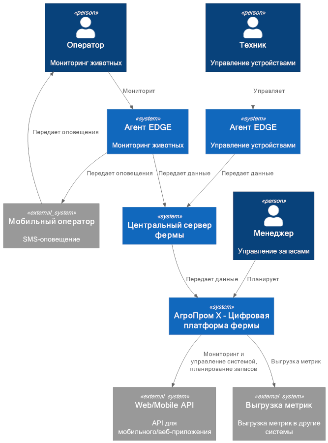

### **Название задачи: MVP архитектуры для платформы мониторинга скота** 
### **Автор: Сергей Бузунов**
### **Дата: 27.10.2025**
### **Функциональные требования**

|**№**|**Действующие лица или системы**|**Use Case**|**Описание**|
| UC-01 | Пользователь, платформа | Авторизация | 1. Пользователь вводит номер телефона и пароль.   2. Платформа отправляет СМС с кодом подтверждения.   3. Пользователь вводит код.   4. При успехе платформа отображает пользователю рабочее место |
| UC-02 | Платформа, ОпСоС, оператор | Оповещение | 1. Платформа регистрирует аномальное состояние, поведение или количество животных.   2. Платформа отправляет оператору СМС через оператора сотовой связи.   3. Оператор получает уведомление об инцидента |
| UC-03 | Техник, платформа | Управление устройствами | 1. Техник запрашивает список устройств и их состояние.   2. Платформа отображает список устройкств.   3. Техник выбирает устройство и подает команду.   4. Платформа передает команду на устройство |
| UC-04 | Менеджер, платформа | Управление запасами | 1. Менеджер запрашивает запас кормов и прогноз расхода   2. Платформа выдает рекомендации для пополнения запаса кормов |
| UC-05 | Менеджер, платформа | Пересчет животных | 1. Менеджер запрашивает список и характеристики животных   2. Платформа выдает список животных  |

### **Нефункциональные требования**
Опишите здесь нефункциональные требования и архитектурно значимые требования.

|**№**|**Требование**|
| R-01 | Отказоустойчивость на уровне 99,95% |
| R-02 | После восстановления связи синхронизировать состояние между агентами и центральным сервером |
| R-03 | Отправляь уведомления операторам при отсутствии интернента |
| P-01 | Поддерживать неограниченное количество агентов |
| P-02 | Обеспечивать задержку не более 10 минут при синхронизации агента с сервером (без учета проблем со связью) |
| P-03 | От момента возникновения нештатной ситуации, зафиксированной с помощью видеоаналитики, должно проходить не более 5 секунд до момента оповещения оператора |
| P-04 | Позволять системе видеоаналитики реагировать в реальном времени (миллисекунды) |
| +R-01 | Платформа должна быть построена по принципу «центральный сервер — агенты» |
| +R-02 | На ферме нестабильный WiFi, поэтому нужно продумать альтернативные каналы связи |
| +R-03 | На каждой ферме допустимо использовать один центральный сервер и необходимый набор edge-устройств |

### **Решение**

В первом варианте оперативное управление реализуется на ферме с подключением оператора (мониторинг состояния животных) и техника (управление устройствами фермы) на агентах. Это гарантирует оперативность реакции на инциденты даже при отсутствии интернета и связи с центральным сервером фермы (нестабильный WiFi). Центральный сервер фермы отвечает за передачу данных на общую платформу. Оповещение оператора по SMS также реализуется на агенте. Рабочее место менеджера организовано на цифровой платформе, т.к. заказ кормов и бизнес-аналитика не являются частью оперативного реагирования на инцеденты.
### **Альтернативы**
В качестве альтернативы рабочие места оператора и техника размещаются на платформе, что упрощает решение, но создает риски несвоевременной реакции на инцеденты при проблемах со связью. 

**Недостатки, ограничения, риски**
Разные типы пользователей работают с разными приложениями, нет единой системы аутентификации.
Подключение оповещения на агенте предполагает более дорогой способ оповещения через SMS вместо пуш-уведомлений, отсутствует централизация оповещения. 

