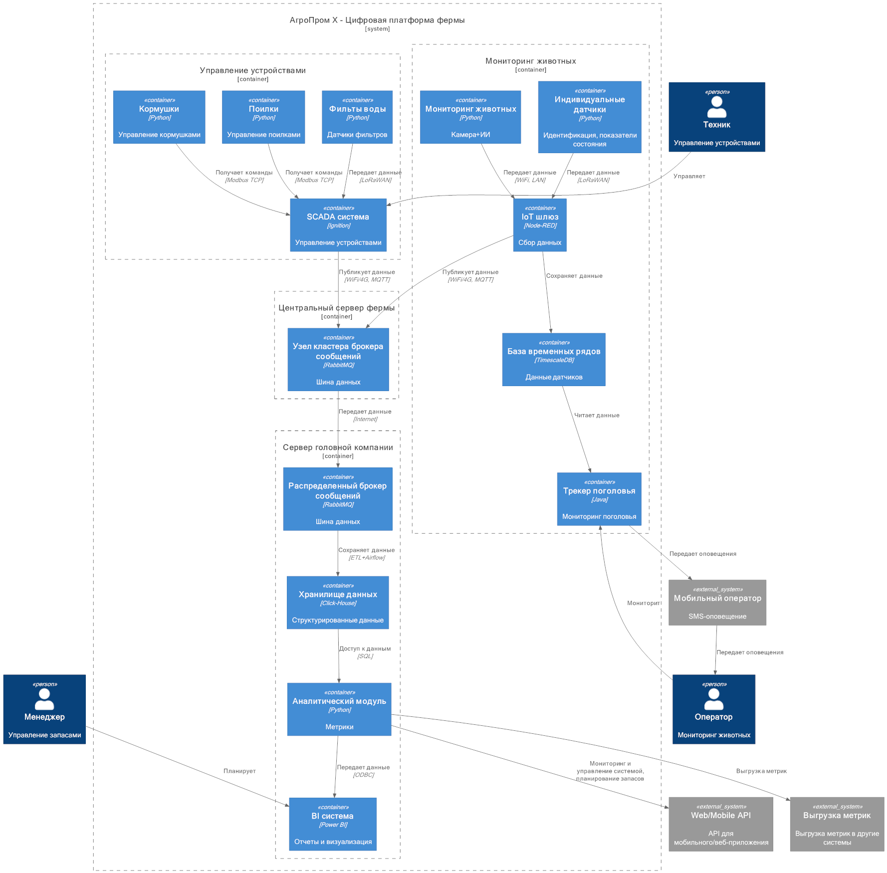
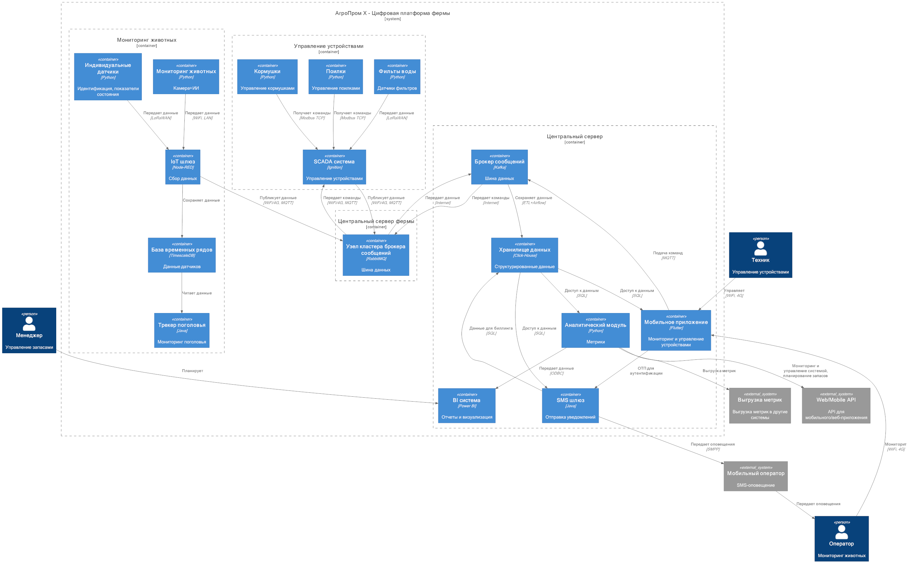

### **Название задачи: MVP архитектуры для платформы мониторинга скота** 
### **Автор: Сергей Бузунов**
### **Дата: 27.10.2025**
### **Функциональные требования**

|**№**|**Действующие лица или системы**|**Use Case**|**Описание**|
| UC-01 | Пользователь, платформа | Авторизация | 1. Пользователь вводит номер телефона и пароль.   2. Платформа отправляет СМС с кодом подтверждения.   3. Пользователь вводит код.   4. При успехе платформа отображает пользователю рабочее место |
| UC-01.01 | Техник, SCADA-система | Авторизация в SCADA-системе | 1. Техник вводит номер телефона и пароль.   2. SCADA-система отправляет СМС с кодом подтверждения.   3. Техник вводит код.   4. При успехе SCADA-система отображает рабочее место |
| UC-01.02 | Оператор, Трекер поголовья | Авторизация в Трекере поголовья | 1. Оператор вводит номер телефона и пароль.   2. Трекер отправляет СМС с кодом подтверждения.   3. Оператор вводит код.   4. При успехе Трекер отображает рабочее место |
| UC-01.03 | Менеджер, BI-система | Авторизация в BI-системе | 1. Менеджер вводит номер телефона и пароль.   2. BI-система отправляет СМС с кодом подтверждения.   3. Менеджер вводит код.   4. При успехе BI-система отображает рабочее место |
| UC-02 | IoT шлюз, ОпСоС, оператор | Оповещение | 1. IoT шлюз регистрирует аномальное состояние, поведение или количество животных.   2. IoT шлюз отправляет оператору СМС через оператора сотовой связи.   3. Оператор получает уведомление об инцидента |
| UC-02.01 | Оператор, Трекер поголовья | Мониторинг поголовья | 1. Оператор запрашивает список животных и их состояние.   2. Трекер отображает список животных |
| UC-03 | Техник, SCADA-система | Управление устройствами | 1. Техник запрашивает список устройств и их состояние.   2. SCADA-система отображает список устройкств.   3. Техник выбирает устройство и подает команду.   4. SCADA-система передает команду на устройство |
| UC-03.01 | Техник, SCADA-система | Управление кормушками | 1. Техник запрашивает список кормушек и их состояние.   2. SCADA-система отображает список кормушек.   3. Техник выбирает кормушку и подает подачи корма.   4. SCADA-система передает команду на кормушку |
| UC-03.02 | Техник, SCADA-система | Управление поилками | 1. Техник запрашивает список поилок и их состояние.   2. SCADA-система отображает список поилок.   3. Техник выбирает поилку и подает подачи воды.   4. SCADA-система передает команду на поилку |
| UC-03.03 | Техник, SCADA-система | Мониторинг фильтров | 1. Техник запрашивает список фильтров воды и их состояние.   2. SCADA-система отображает список фильтров |
| UC-04 | Менеджер, BI-система | Управление запасами | 1. Менеджер запрашивает запас кормов и прогноз расхода   2. BI-система выдает рекомендации для пополнения запаса кормов |
| UC-05 | Менеджер, BI-система | Пересчет животных | 1. Менеджер запрашивает список и характеристики животных   2. BI-система выдает список животных  |
| UC-06 | Менеджер, BI-система | Добавление метрики | 1. Менеджер добавляет и настраивает новую метрику   2. Новая метрика добавлена в систему |

### **Нефункциональные требования**
|**№**|**Требование**|
| R-01 | Отказоустойчивость на уровне 99,95% |
| R-02 | После восстановления связи синхронизировать состояние между агентами и центральным сервером |
| R-03 | Отправляь уведомления операторам при отсутствии интернента |
| P-01 | Поддерживать неограниченное количество агентов |
| P-02 | Обеспечивать задержку не более 10 минут при синхронизации агента с сервером (без учета проблем со связью) |
| P-03 | От момента возникновения нештатной ситуации, зафиксированной с помощью видеоаналитики, должно проходить не более 5 секунд до момента оповещения оператора |
| P-04 | Позволять системе видеоаналитики реагировать в реальном времени (миллисекунды) |
| +R-01 | Платформа должна быть построена по принципу «центральный сервер — агенты» |
| +R-02 | На ферме нестабильный WiFi, поэтому нужно продумать альтернативные каналы связи |
| +R-03 | На каждой ферме допустимо использовать один центральный сервер и необходимый набор edge-устройств |

### **Решение**

В проекте используется множество устройств разных производителей для управления и мониторинга устройств на ферме: кормушек, поилок, фильтров для воды. От устройств нужно получать данные и управлять ими. Т.к. у компании АгроПром Х в текущей цифровой платформе уже есть опыт организации управления устроствами с помощью SCADA-системы Ignition, а так же реализация и поддержка кода на Python для разнообразных устройств и датчиков тепличного хозяйства, решено переиспользовать этот подход. Дополнительно потребуется настройка SCADA-системы и разработка драйверов для новых устройств и датчиков.
В проекте используется видеокамеры с подключенной системой распознавания животных и аномального поведения. У компании АгроПром Х есть опыт реализации агента мониторинга урожая. Решено переиспользовать этот подход, подключив систему распознавания партнера и доработав код Python. 
Принято решение основное подключение вилеокамер выполнять через LAN. Это позволит гарантировано отслеживать инцеденты при нестабильном WiFi-соединении. Т.к. ферма имеет ограниченную площат и несущие конструкции, монтаж проводной сети предпочтительнее использования 4G-подключения, которое может быть нестабильно. WiFi может использоваться для мониторинга в реальном времени и выгрузки видео партнеру для дообучения модели ИИ (не входит в MVP).     
В проекте используется RFID-метки для животных и датчики состояния животного.  У компании АгроПром Х есть опыт реализации подсистемы мониторинга на базе IoT-шлюза, базы временных рядов и Java-приложения мониторинга. Решено переиспользовать эту подсистему, разработав приложение Java для трекера поголовья на основе существующего приложения треккинга техники.
В качестве брокера сообщений используется RabbitMQ для передачи данных от агентов на центральный сервер. Это позволит использовать протокол MQTT для взаимодействия с устройствами. По сравнению с Kafka RabbitMQ проще в настройке и сопровождении, не требователен к ресурсам и обеспечивает необходимую производительность.
Для хранилища структурированных данных выбрана СУБД Click-House, опыт использования и интеграции с которой есть у АгроПром Х. Неструктурированные данные (видеопоток) решено не хранить. Для выгрузки видео партнеру для дообучения модели ИИ будет использоваться видеопоток с камер через WiFi (не входит в MVP).
В качестве аналитического модуля для отслеживания базовых и дополнительных метрик принято решение переиспользовать аналитический модуль АгроПром Х, написанный на Python, доработав его под новые структуры данных. В качестве системы мониторинга и настройки метрик принято решение переиспользовать Power BI в качестве BI-системы. В аналитическом модуле также необходимо будет доработать выгрузку метрик во внешние системы и поддержку API интеграции с Web/Mobile-приложением.

### **Альтернативы**
При более высокой нагрузке в качестве брокера лучше использовать Kafka (второй вариант).

**Недостатки, ограничения, риски**
Т.к. в МVP отсутствует веб-портал, разные типы пользователей работают с разными приложениями, нет единой системы аутентификации.
Т.к. в МVP отсутствует мобильное приложение, используется более дорогой способ оповещения через SMS вместо пуш-уведомлений.

